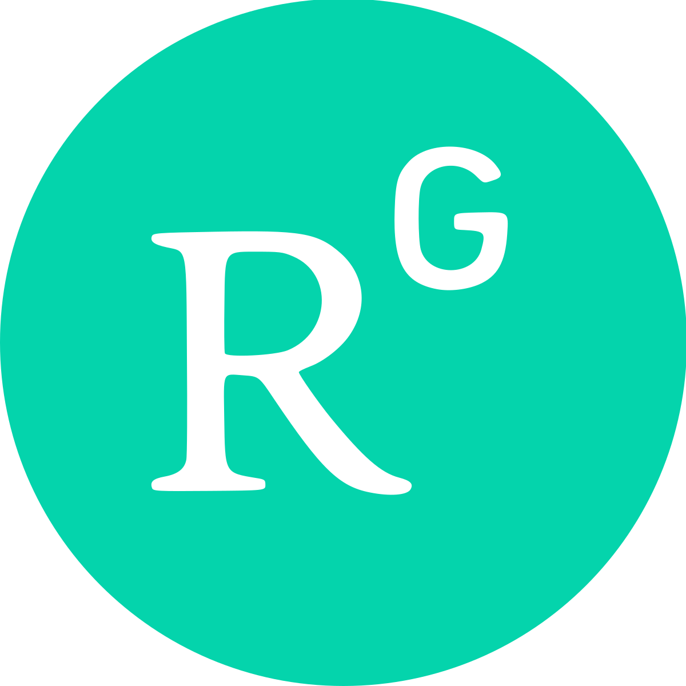

### Código Abierto en Química Computacional
Dr. Marcos Rivera Almazo   

Contacto: mrivera@izt.uam.mx

|||
|--|--|
|||

### Versión en linea

https://molecular-mar.github.io/openChem_ceuami

## Contenido

* ### Código abierto
* ### Casos
  * ### Dinámica Molecular
  * ### Química Cuántica
  * ### Visualización

## Pero primero...

## CEUAMI: 20 años

---

## Código abierto

                           

* Termino propuesto en los 90's. Software que cumpla con:
  * Acceso libre al código
  * Modificable
  * Redistribuible
  * Descentralizado

                           
  

## Química Computacional

* Uso de herramientas computacionales para asistir en la resolución de problemas químicos
* Primeros usos, junto con las primeras computadoras digitales (40's)

EDSAC, Universidad de Cambridge (50's)

* Programas más eficientes en los 70's (Gaussian)
* Inicios *abiertos*: códigos accesibles mediante el QCPE (tarjetas perforadas, diskets, cd, FTP).
* Favoreció el desarrollo: probar ideas, colaborar.

---

## Algunos ejemplos:

## Dinámica Molecular

* Simular el movimiento y comportamiento de moléculas.
* Efectos de fuerzas por molécula (distancias, ángulos) y entre ellas.
* Campos de fuerzas

## Códigos:

* GROMACS: 1991, Groeningen, Holanda. Berendsen Group.
* Ampliamente usado para sistemas biológicos
* Ejecución en CPU/GPU.

                           

* LAMMPS: 90's, Sandia Laboratory, EU. 
* Masivamente paralelizable (MPI, OpenMP, GPU)

                           

---

# Química cuántica

* Describimos el comportamiento de los electrones. Protagonistas en Química (enlaces).
* Descripción a nivel cuántico.
* Alta precisión, alto costo computacional.

### Ejemplo: interacción Benceno-MOF
<!-- |||
|--|--|
| |<model-viewer bounds="tight" enable-pan src="mfmIn_bpath_New.glb" ar ar-modes="webxr scene-viewer quick-look" camera-controls environment-image="neutral" camera-orbit="0deg 90deg 2m" poster="img/poster.png" shadow-intensity="0" auto-rotate interaction-prompt=none></model-viewer>| -->

        <model-viewer bounds="tight" 
 	        enable-pan src="models3D/mfmIn_bpath_New.glb"
	        camera-controls environment-image="neutral" 
            camera-orbit="-4.9deg 86.11deg 3.512m" field-of-view="25.77deg" ar ar-modes="scene-viewer webxr quick-look"
        	poster="img/poster.png" 
        	shadow-intensity="0" auto-rotate
            interaction-prompt=none>
        </model-viewer>
    

Rivera-Almazo, M. et al. Isostructural MFM-300(Sc) and MFM-300(In): Adsorption Behavior to Determine Their Differences. J. Phys. Chem. C 300, (2022).

## Algunos ejemplos

 

* NWChem: 1992, PNNL, EU.
* Diversos métodos: DFT, CC, MD.
* Escalable: amplio uso en supercómputo

* Otros ejemplos:
  * CP2K, Quantum ESPRESSO, SIESTA, Psi4, PySCF

* Para moléculas, sistemas periódicos (polímeros, superficies, cristales).

---

## Visualización

* Auxiliares para interpretrar/comunicar resultados de simulaciones/experimentos.

* Avogadro: 2007.
* Algunas capacidades:
  * Visualizar archivos *moleculares*
  * Construir/editar moléculas
  * Dinámica molecular básica
  * Auxiliar para otros programas.

 

* Jmol: 2000's
  * Visualizar dinámicas
  * Animaciones
  * Basado en Java. Puede usarse en el navegador.
  * Lectura de una gran variedad de formatos

 

---

## Beneficios del código abierto en QC

* Accesibilidad
* Plataformas para desarrollo
* Implementaciones tempranas
* Comunidad 

## ¿Cómo contribuir?

* GitHub
* GitLab
* Google Summer of Code

## ¡Gracias por la atención!
### ¿Preguntas?
### https://linktr.ee/malmazo

 

